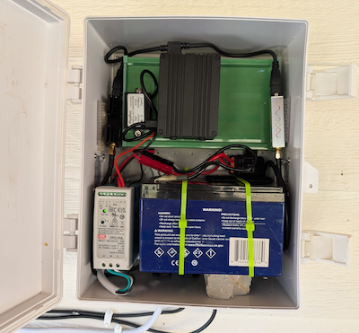
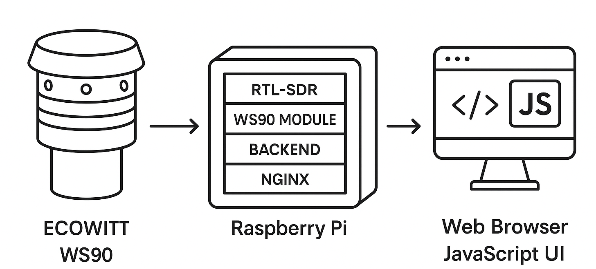

# The vinthewrench Weather System

This is the  weather system we use at Stella Porta® Farm, It is a self-contained, **cloudless** weather station built around the Ecowitt WS90, an RTL SDR, and a Raspberry Pi.  

No vendor cloud. No subscriptions. No “create an account to see your own sky.” Everything runs on your hardware, on your network.

If you want a $59 plastic weather toy from a big box store, this is not that.  
If you want something you can understand, fix, and own, read on.

Read the article at  https://www.vinthewrench.com/p/build-your-own-off-grid-weather-station

---

## Table of Contents

- [What This Thing Actually Does](#what-this-thing-actually-does)
- [Hardware](#hardware)
  - [Weather Sensor: Ecowitt WS90](#weather-sensor-ecowitt-ws90)
  - [Raspberry Pi](#raspberry-pi)
  - [My Implementation](#my-implementation)
  - [Optional Display Node](#optional-display-node)
- [30000 Foot View](#30000-foot-view)
- [System Architecture](#system-architecture)
  - [Two Stacks: ws90 and ecowitt](#two-stacks-ws90-and-ecowitt)
  - [Backend Deep Dive](#backend-deep-dive)
- [Persistence and History](#persistence-and-history)
  - [State Files](#state-files)
  - [SQLite Schema](#sqlite-schema)
- [Ports and Services](#ports-and-services)
- [Directory Layout](#directory-layout)
- [Installation](#installation)
  - [Requirements](#requirements)
  - [One Time Pi Setup](#one-time-pi-setup)
  - [Building and Running ws90](#building-and-running-ws90)
  - [Building and Running ecowitt](#building-and-running-ecowitt)
- [Configuration](#configuration)
  - [RF Frequency](#rf-frequency)
  - [Location and Time](#location-and-time)
- [JSON API](#json-api)
- [Resetting State Safely](#resetting-state-safely)
- [Troubleshooting and RF Tools](#troubleshooting-and-rf-tools)
- [Security Notes](#security-notes)
- [USB Notes](#usb-notes)
- [Cloudflare Tunnel (Optional, Recommended for Remote Access)](#cloudflare-tunnel-optional-recommended-for-remote-access)
- [Optional External Weather Service Feeders](#optional-external-weather-service-feeders)
  - [Weather Underground Feeder](#weather-underground-feeder)
  - [Windy Feeder](#windy-feeder)
- [Acknowledgments](#acknowledgments)
- [License](#license)

---

## What This Thing Actually Does

The whole process starts with the weather sensor itself. In this build I’m using an Ecowitt WS90, but the architecture works with plenty of other sensor heads if you’re willing to cut, weld, and adapt the inputs. The WS90 sends out a small RF packet every few seconds. It knows nothing about “today’s rain,” “this week,” or “the high for the day”—it just spits raw sensor values into the air. Everything that turns those raw packets into real weather happens downstream.

The system:

1. Listens to those RF packets using an RTL SDR.
2. Uses `rtl_433` to decode them into JSON.
3. Runs a C++ backend that:
   - Reconstructs rainfall correctly over time.
   - Tracks highs and lows for temperature, humidity, and wind.
   - Computes sunrise, sunset, and moon phase locally.
   - Detects stale data and sensor issues.
4. Stores a compact state snapshot plus a small SQLite history database.
5. Serves a web dashboard that hits a local JSON API. No internet required.

End result: a weather station that behaves like an appliance instead of a random assortment of scripts.

---

## Hardware

### Weather Sensor: Ecowitt WS90

#### What the WS90 JSON Looks Like

The WS90 itself doesn’t know anything about “today’s rain” or “the high for the day.” It only transmits a raw RF packet. `rtl_433` decodes that packet and turns it into JSON. A typical WS90 reading looks like this:

```json
{
  "time": "2025-12-08T18:21:34",
  "model": "Fineoffset-WS90",
  "id": 82997,
  "temperature_C": 4.8,
  "humidity": 82,
  "uv": 0,
  "light_lux": 2725,
  "wind_speed_m_s": 1.8,
  "wind_gust_m_s": 4.4,
  "wind_dir_deg": 274,
  "rain_mm": 118.9,
  "battery": "ok"
}
```

A few notes that matter:

- **`id` is the unique sensor identifier broadcast by your WS90.** If you have multiple FineOffset/Ecowitt devices on the same ISM frequency, you'll see multiple IDs in the stream.
- Filtering ensures you only process *your* device.
- The backend only needs the latest valid packet.


The Ecowitt WS90 is a compact, all-in-one weather sensor head. It has no display and no built-in intelligence. It broadcasts raw RF packets containing wind, rain, temperature, humidity, light, and UV data every few seconds. It does not track daily or weekly totals and performs no aggregation. The backend in this project performs all stateful weather computation.

Inside the WS90:
- Ultrasonic anemometer
- Haptic rain sensor
- Temperature and humidity sensor
- Light and UV sensors
- Solar panel, supercapacitor, backup battery
- ISM-band RF transmitter

Any other weather sensor can be substituted if it emits JSON or can be adapted into the backend input stage.
 
### Raspberry Pi
You might ask why I chose a Raspberry Pi Instead of an Arduino or ESP32? You *could* try to build this on an Arduino or ESP32, but only if you enjoy pain; they simply can’t run `rtl_433`, can’t host multiple services, can’t maintain real state, and can’t behave like a Linux system no matter how many libraries you duct-tape onto them. A Raspberry Pi, on the other hand, is the right tool because the job needs an actual operating system, not a microcontroller doing cosplay.

A Pi gives me:

#### A Real Linux Box

Which means:

* real processes
* real filesystems
* real logs
* SSH
* proper debugging tools
* predictable networking
* and the ability to fix things like a grown-up

Your weather system is not “read a value and blink an LED.” It’s running an RF decoder, a backend API, a frontend server, a state engine, and writing historical data — all at the same time. That calls for Linux, not FreeRTOS.

#### Containers Make It Clean

The Pi runs Docker natively, giving me isolated environments for:

* the ws90 RF listener
* the ecowitt backend
* the nginx frontend

Docker works by using Linux **namespaces** and **cgroups** to create lightweight, isolated “spaces” that keep each service from stepping on the others.

This architecture would be impossible on an ESP32.

#### It Can Run Other Useful Services

Because it’s full Linux, I can also run:

* an ADS-B feeder
* a Cloudflare Tunnel
* a local MQTT broker
* a UPS monitor
* or anything else I feel like adding later

The Pi becomes a small, reliable homestead server, not just a sensor interface.

#### Local Battery Backup

I designed a small battery backup system so the Pi stays alive during power outages.
That means no corrupted state files, no missing history, and no guessing about rainfall when the lights come back on.

#### Networking Done My Way

I replaced the usual Raspberry Pi `wpa_supplicant` setup with **NetworkManager**, because it’s cleaner, more predictable, and doesn’t fight you for fun.
That deserves its own article, but it’s part of why the Pi makes sense here.

#### Other Practical Reasons

* SQLite runs reliably on ext4 filesystem
* Multiple USB ports for SDRs and storage
* Easy remote maintenance
* Mature logging for diagnosing RF issues
* A fast development loop: edit → build → run, not “flash → pray”

In short:
An ESP32 is a screwdriver.
A Raspberry Pi is a toolbox.
This project needs the toolbox.
 

### My Implementation
You do not need to clone this exact build, but here is what I actually used.




| Component | Price | Link |
|----------|-------|------|
| **Ecowitt WS90 Ultrasonic Sensor** | **$149.99** | https://shop.ecowitt.com/products/ws90 |
| **Raspberry Pi (3, 4, or 5)** | ~**$60** | varies |
| **Nooelec NESDR SMArt (RTL SDR)** | ~**$48** | https://www.nooelec.com/store/nesdr-smart.html |
| **915 MHz ISM Antenna** | ~**$7** | https://www.nooelec.com/store/915mhz-ism-antenna-3dbi-sma.html |
| **Mean Well DRC 40A** (AC supply + SLA charger) | ~**$30** | https://mou.sr/47cH5Kb |
| **Mighty Max ML22 12 SLA Battery (22 Ah)** | ~**$50** | https://www.amazon.com/dp/B00K8V2Y2E |
| **PlusRoc 12/24 V → 5 V USB C buck converter** | ~**$10** | https://www.amazon.com/dp/B0FD6M8D7K |
| **Outdoor polycarbonate enclosure** | ~**$40** | https://www.amazon.com/dp/B0C4YK2MWZ |

**Core system cost:** roughly **$440**, depending on how much you already own.

#### Recommended extras

- USB extension cable to move the SDR away from Pi noise.
- A mast or pole to get the WS90 up in clean air, not in the wind shadow of your house.
- A rock under the battery, because I didn’t feel like fabricating a proper battery holder.

### Optional Display Node

If you want a permanent wall display:

| Component | Price | Link |
|----------|--------|------|
| **Waveshare 7″ HDMI touchscreen** | ~**$80** | varies |
| **Additional Raspberry Pi** | ~**$60** | varies |


The dashboard is just a simple web page. Anything with a browser can view it —
your phone, your tablet, that ten-year-old laptop you won’t throw out, probably
even your TV or the [Internet-of-Things refrigerator](https://www.youtube.com/watch?v=K3pYZwol6Dc) that keeps trying to upsell
you yogurt.

---

## 30000 Foot View

Here’s the play-by-play of what actually happens under the hood.



Here is the data path:

1. **WS90 sensor → RF transmission**  
   WS90 broadcasts a packet roughly every five seconds. It reports temperature, humidity, wind via an ultrasonic anemometer, rainfall via a haptic sensor, plus light and UV.

2. **RF capture → RTL SDR**  
   The RTL SDR listens on the ISM band, digitizes the signal, and hands IQ data to `rtl_433`.

3. **RF → JSON via rtl_433**  
   `rtl_433` recognizes the WS90 protocol, validates each packet, and produces structured JSON.

4. **JSON → backend state engine**  
   A C++ backend consumes those raw packets and maintains a full weather model:
   - Detects rain counter wraparound.
   - Computes hourly, daily, weekly, monthly, yearly totals.
   - Tracks temperature and humidity highs and lows.
   - Smooths wind and records gusts.
   - Tracks WS90 battery and supercap.
   - Marks data as stale when packets stop.

5. **Astronomy**  
   Backend also computes sunrise, sunset, civil twilight, moon phase, moon illumination, and Julian day using latitude and longitude.

6. **Persistence**  
   Rolling state is stored in a JSON checkpoint file. Long term history goes into a small SQLite database.

7. **Backend → JSON API**  
   The backend exposes a single HTTP JSON API on port 8888.

8. **nginx → Web UI**  
   nginx serves the static dashboard and proxies `/api/` to the backend.

The result is a fully self contained, local weather appliance that does not care if your internet is up.

---

## System Architecture

The system is split into multiple stacks:

1. `ws90`  
2. `ecowitt`

Both use Docker.

### `ws90` stack

Lives in `ws90/`.

- Builds a simple container that:
  - Owns the RTL SDR USB device.
  - Runs `rtl_433` tuned to the WS90 frequency.
  - Serves decoded WS90 JSON on port 7890.
- Stateless. If you kill it, nothing permanent is lost.

The compose file:

```yaml
services:
  ws90:
    build: .
    container_name: ws90
    restart: unless-stopped

    devices:
      - /dev/bus/usb:/dev/bus/usb

    environment:
      TZ: "America/Chicago"
      FREQUENCY: "915000000"

    ports:
      - "7890:7890"
```

### `ecowitt` stack

Lives in `ecowitt/`.

- `ecowitt-backend`  
  C++ backend that:
  - Polls `ws90` JSON.
  - Maintains rolling rainfall and environmental state.
  - Computes astronomy.
  - Writes the state checkpoint JSON and SQLite DB.
  - Serves `/api/weather` on port 8888.

- `ecowitt-nginx`  
  Lightweight nginx instance that:
  - Serves static HTML and JS.
  - Proxies `/api/` to `ecowitt-backend` inside the Docker network.

Compose:

```yaml
services:
  ecowitt-nginx:
    image: nginx:alpine
    container_name: ecowitt-nginx
    restart: unless-stopped
    volumes:
      - ./html:/usr/share/nginx/html:ro
      - ./nginx.conf:/etc/nginx/nginx.conf:ro
      - ./state:/state
    environment:
      TZ: "America/Chicago"
    ports:
      - "8889:8889"

  ecowitt-backend:
    build: ./backend_v2
    container_name: ecowitt-backend
    restart: unless-stopped
    environment:
      TZ: "America/Chicago"
      LATITUDE: "41.8262"   # You will override these
      LONGITUDE: "-87.6841"
    volumes:
      - ./state:/state
    ports:
      - "8888:8888"
```

nginx config:

```nginx
resolver 127.0.0.1 valid=10;

events { }

http {
    include       mime.types;
    default_type  application/octet-stream;

    sendfile        on;
    keepalive_timeout  65;

    server {
        listen 8889;

        location / {
            try_files $uri $uri/ =404;
        }

        location /api/ {
            proxy_pass http://ecowitt-backend:8888/;
            proxy_connect_timeout 1s;
            proxy_read_timeout 10s;
            proxy_send_timeout 10s;
        }
    }
}
```

### Backend Deep Dive

The backend is where the WS90 turns into something a human would call “weather.”

#### Rainfall reconstruction

The WS90 reports a raw rain accumulator in millimeters. That is not “today’s rain.” It is just a counter.

The backend:

- Tracks the last raw WS90 accumulator (`last_rain_mm`).
- Detects when the counter wraps or jumps.
- Computes:
  - `rain_hourly_in`
  - `rain_daily_in`
  - `rain_weekly_in`
  - `rain_monthly_in`
  - `rain_yearly_in`
  - `rain_event_in`
- Keeps “historical” totals used when seeding or restoring state:
  - `historical_total_in`
  - `historical_monthly_in`
  - `historical_weekly_in`
  - `historical_yearly_in`
  - `historical_seeded` flag to indicate manual seeding.

All of this lives in the JSON state file described later.

#### Environmental metrics

The WS90 does not provide daily highs and lows. The backend calculates them:

- `temp_high_c`, `temp_low_c`
- `humidity_high`, `humidity_low`
- `have_temp`, `have_hum` flags
- Wind:
  - `wind_max_gust_m_s`
  - `wind_mean_m_s`
  - `wind_sample_count`

Daily anchoring fields:

- `daily_ymd`
- `day_first_ts`
- `day_last_ts`
- `week_start_ymd`
- `month_ym`
- `year_y`

These tell the backend which day/week/month/year is currently “active.”

#### Astronomy

Backend computes:

- Sunrise and sunset.
- Civil twilight.
- Moon phase and illumination.
- Julian day.

All of it is done locally in C++, using `LATITUDE` and `LONGITUDE` from the environment.

---

## Persistence and History

The backend uses two layers of persistence.

### State Files

All persistent files are under:

```text
ecowitt/state/
```

They are bind mounted into the backend and nginx at `/state`.

There are two main files:

#### 1. `rain_state_v2.json`

This is the **live engine checkpoint**. An example looks like this:

```json
{
  "daily_ymd": 20251202,
  "day_first_ts": 1764655208,
  "day_last_ts": 1764725344,
  "have_hum": true,
  "have_temp": true,
  "have_wind": true,
  "historical_monthly_in": 4.27,
  "historical_seeded": true,
  "historical_total_in": 62.77,
  "historical_weekly_in": 1.96,
  "historical_yearly_in": 62.77,
  "hum_high": 95.0,
  "hum_low": 62.0,
  "last_rain_mm": 118.9,
  "last_update_ts": 1764725344,
  "month_ym": 202512,
  "rain_daily_in": 0.007874015748031607,
  "rain_event_in": 0.003937007874016084,
  "rain_hourly_in": 0.003937007874016084,
  "rain_monthly_in": 0.13779527559055113,
  "rain_weekly_in": 2.1883464566929187,
  "rain_yearly_in": 62.998346456692886,
  "temp_high_c": 6.0,
  "temp_low_c": -2.4,
  "week_start_ymd": 20251129,
  "wind_max_gust_m_s": 4.2,
  "wind_mean_m_s": 1.1243969377437517,
  "wind_sample_count": 6923,
  "year_y": 2025
}
```

This file contains:

- Current day/week/month/year anchor.
- Daily highs and lows for temp and humidity.
- Wind gust and mean statistics.
- All rolling rainfall totals.
- Historical totals and seeded flags.
- Timestamp of last update.

It is rewritten frequently and read on startup so the backend can resume exactly where it left off.

If you delete it, the backend will reconstruct what it can from:

- The WS90 raw accumulator.
- The SQLite daily history.

You will lose the current day’s in progress details. That may be acceptable when doing a reset.

#### 2. `weather_history_v2.sqlite3`

This is the long term history database. It stores daily rollups and nothing else. It is small and simple on purpose.

### SQLite Schema

Right now the key table is:

```sql
CREATE TABLE daily_weather (
  day_ts        INTEGER PRIMARY KEY,
  temp_high_c   REAL,
  temp_low_c    REAL,
  humidity_high REAL,
  humidity_low  REAL,
  rain_in       REAL
);
```

Meaning:

- `day_ts`  
  Unix timestamp for the start of the day (usually midnight local time).

- `temp_high_c`, `temp_low_c`  
  The highest and lowest temperatures seen that day.

- `humidity_high`, `humidity_low`  
  Daily highs and lows for humidity.

- `rain_in`  
  Total rain for that day in inches.

The backend writes one row as a day completes. That row is never updated again. All intra day statistics live only in `rain_state_v2.json`.

---

## Ports and Services

On the host:

- **7890**  
  `ws90` HTTP JSON output from the RTL SDR listener.

- **8888**  
  Backend JSON API inside the ecowitt stack. Exposed on the host for debugging and optional direct access.

- **8889**  
  nginx web UI. The dashboard and `/api/` are served here.

Recommended pattern:

- Point users and browsers at `http://your-pi:8889/`.
- Let nginx talk to `ecowitt-backend`.
- Let `ecowitt-backend` talk to `ws90`.

---

## Directory Layout

On the host, a typical layout looks like this:

```text
server/
├── ws90/
│   ├── Dockerfile
│   ├── Makefile
│   ├── docker-compose.yml
│   ├── entrypoint.sh
│   ├── bin/
│   └── src/
│
└── ecowitt/
    ├── backend_v2/
    │   ├── Dockerfile
    │   ├── Makefile
    │   └── src/
    ├── html/
    │   ├── index.html
    │   ├── rain_history.html
    │   ├── temperature_history.html
    │   ├── humidity_history.html
    │   ├── data.html
    │   ├── common_history.js
    │   └── weather-common.css
    ├── state/
    │   ├── rain_state_v2.json
    │   └── weather_history_v2.sqlite3
    ├── docker-compose.yml
    └── nginx.conf
```

You can organize it however you like as long as the relative paths within each stack match their compose files.

---

## Installation

### Requirements

- Raspberry Pi 4 or 5, 64 bit Raspberry Pi OS (Bookworm or newer).
- Ecowitt WS90 weather sensor.
- RTL SDR V3 or compatible.
- Docker and the docker compose plugin.
- A basic understanding of Linux so you are not surprised when a shell prompt appears.

This has been developed and tested on a Pi. It will probably run on other Debian like systems. If you point it at some random cloud VM with a fake SDR, you are on your own.

### One Time Pi Setup

Update system and install tools:

```sh
sudo apt update
sudo apt upgrade -y

sudo apt install -y \
  git curl usbutils \
  docker.io docker-compose-plugin \
  rtl-sdr rtl-433 sqlite3
```

Add your user to the docker group so you do not have to type sudo all the time:

```sh
sudo usermod -aG docker $USER
# log out and back in
```

Blacklist the DVB driver that grabs the RTL SDR before rtl_433 can use it:

```sh
echo "blacklist dvb_usb_rtl28xxu" | sudo tee /etc/modprobe.d/blacklist-rtl.conf
sudo update-initramfs -u
```

Reboot so the blacklist actually applies:

```sh
sudo reboot
```

After reboot, plug in the RTL SDR and verify it shows up:

```sh
lsusb | grep -i rtl
```

Program a persistent serial for the SDR (optional but sane if you have multiple SDRs):

```sh
rtl_eeprom -d 0 -s WS90
```

Unplug and replug the dongle after that change.

### Building and Running ws90

Place the `ws90/` directory on the Pi.

From inside `ws90/`:

```sh
docker compose build
docker compose up -d
```

Check that the container is running:

```sh
docker ps
```

Test the HTTP endpoint:

```sh
curl http://localhost:7890/
```

You should see WS90 packets in JSON. If not, see the troubleshooting section.

> ⚠️ **Important:** Also see the [USB Notes](#usb-notes) later in this document.  
> USB autosuspend *must* be disabled for reliable SDR operation.


### Building and Running ecowitt

Place the `ecowitt/` directory alongside `ws90/`.

From inside `ecowitt/`:

```sh
docker compose build
docker compose up -d
```

Then point a browser at:

```text
http://your-pi:8889/
```

You should see the dashboard. If the UI loads but shows no data, the backend or ws90 stack is not happy. Again, see troubleshooting.

---

## Configuration

### RF Frequency

The WS90 uses different bands depending on region:

- US: typically 915 MHz.
- EU and many other regions: often 433 or 868 MHz.

The listener stack is configured via the `FREQUENCY` environment variable in `ws90/docker-compose.yml`:

```yaml
environment:
  TZ: "America/Chicago"
  FREQUENCY: "915000000"
```

Change that value to match your WS90 region.

If this is wrong, rtl_433 will see nothing useful and your dashboard will be dead.

### Location and Time

Astronomy is computed locally. You must set `LATITUDE` and `LONGITUDE` in `ecowitt/docker-compose.yml`:

```yaml
environment:
  TZ: "America/Chicago"
  LATITUDE: "41.8262"
  LONGITUDE: "-87.6841"
```

Use decimal degrees. North and east are positive, south and west are negative.

If these are garbage, your sunrise and sunset will be wrong, and the moon will appear to live in an alternate universe. If that is your goal, enjoy, but do not blame the code.

---

## JSON API

The backend exposes a single main endpoint:

- `http://your-pi:8888/api/weather` from the backend directly.
- `http://your-pi:8889/api/weather` via nginx.

The response is a synthesized JSON document that combines:

- Current WS90 readings.
- Rolling rainfall totals.
- Daily highs and lows.
- Astronomy.

A sample looks like:

```json
{
  "api_version": "2.1.0",
  "astro": {
    "time_zone": "UTC",
    "moon": {
      "phase": 0.667,
      "segment": "Waning Gibbous",
      "visible": 0.7486
    },
    "sun": {
      "sunrise_ts": 1765285720,
      "sunset_ts": 1765321394
    }
  },
  "temperature_F": 32.9,
  "humidity": 99.0,
  "rain": {
    "daily_in": 0.0236,
    "hourly_in": 0.0079,
    "weekly_in": 0.0512,
    "monthly_in": 0.3307,
    "yearly_in": 63.1913,
    "event_in": 0.0079
  },
  "wind_avg_m_s": 2.0,
  "wind_max_m_s": 2.0,
  "wind_dir_deg": 166.0,
  "ws90_status": {
    "http_ok": true,
    "rtlsdr_ok": true,
    "stale": false
  }
}
```

Field names may evolve as the backend grows. The general shape stands.

---

## Resetting State Safely

Sometimes you want to reset rainfall or clean up a mess without destroying your entire history.

The files that matter are under `ecowitt/state/`.

### Reset current rolling state

To reset the current day’s rolling state while keeping daily history:

1. Stop the ecowitt stack:

   ```sh
   cd ecowitt
   docker compose down
   ```

2. Move or remove the JSON state file:

   ```sh
   mv state/rain_state_v2.json state/rain_state_v2.json.bak.$(date +%s)
   # or if you are brave:
   rm state/rain_state_v2.json
   ```

3. Start the stack again:

   ```sh
   docker compose up -d
   ```

The backend will:

- Recreate a fresh state JSON.
- Use the WS90 raw counter and SQLite daily history to re establish totals.
- Lose some detail about the current in progress day, which is the whole point.

### Do not casually delete the SQLite DB

If you remove `weather_history_v2.sqlite3` you lose your daily history:

```sh
rm state/weather_history_v2.sqlite3
```

The system will still run, but all past daily totals are gone. Only do this if you genuinely want a totally fresh start.

---

## Troubleshooting and RF Tools

This is where you end up when “it should work” does not.

### 1. Check the ws90 stack

Is the container up?

```sh
cd ws90
docker compose ps
docker logs ws90
```

If the logs are full of USB or tuner errors, the kernel might still be grabbing the dongle or you have a bad cable.

Try a simple rtl test:

```sh
rtl_test -t
```

If that fails, fix that before blaming anything else.

### 2. Check RF and frequency

You can run rtl_433 directly to see what it thinks:

```sh
docker exec -it ws90 rtl_433 -f 915000000 -s 250k -M peek
```

If you see nothing, and you are sure the WS90 is powered and in range, your frequency or antenna is wrong.

If you are in a 433 or 868 region, adjust `FREQUENCY` accordingly and recreate the ws90 container.

### 3. Check the backend

From the host:

```sh
cd ecowitt
docker compose ps
docker logs ecowitt-backend
```

Then hit the API directly:

```sh
curl http://localhost:8888/api/weather
```

If that fails but nginx works, the proxy is fine and the backend is not.

If that succeeds but the UI shows no data, the frontend and backend are out of sync. Clear your browser cache or check for JavaScript errors.

### 4. Check nginx

Check logs:

```sh
docker logs ecowitt-nginx
```

If `/api/` returns 502 or 504, nginx cannot talk to the backend. Usually that means the backend container is dead or restarting.

---


## Cloudflare Tunnel (Optional, Recommended for Remote Access)

If you want to see your weather station when you are not on the LAN, you have two sane options:

- VPN into your home network.
- Use something like Cloudflare Tunnel.

This setup is read only. There is no control path in the API. That makes it a good fit for an outbound-only tunnel.

The rough idea:

1. Install `cloudflared` on the Pi.
2. Create a tunnel in your Cloudflare account.
3. Point the tunnel at `http://localhost:8889`.
4. Optionally protect it with Cloudflare Access so not everyone on the planet can read your backyard weather.

A very simple `cloudflared` service would:

- Make an outbound only connection to Cloudflare.
- Expose a subdomain like `weather.yourdomain.com`.
- Forward that to the nginx port on the Pi.

You can containerize `cloudflared` as a third stack if you want to keep everything neat.

---

## Security Notes

This system is meant to live on your LAN.
It is not a cloud service.
It does not pretend to be one.
Treat it like hardware you own.

Here are the only rules you actually need to follow:


## **1. Do not expose port 8888 to the public internet**

The backend API is:

* unauthenticated
* unencrypted
* a custom C++ HTTP server
* designed for local use
* full of personal metadata (your real lat/long, timezone, sensor cadence, battery, etc.)

If you drop 8888 onto the open internet, it becomes:

* a free telemetry feed for anyone
* a target for automated scanners
* a fingerprintable device broadcasting your location
* a potential attack surface you don’t need

nginx exists specifically to protect it.
Let nginx be the adult in the room.

### **If you actually want to keep 8888 local-only, do this:**

#### **1. Bind the backend to `127.0.0.1`**

Make sure your C++ backend listens only on localhost:

```
bind("0.0.0.0", 8888);
```

This alone prevents any outside access, even if something else misbehaves.

#### **2. Do NOT publish the port in Docker**

In `docker-compose.yml`, your backend section should have **no** `ports:` block:

```yaml
# no ports: section here
```

This keeps 8888 inside the container network.

#### **3. Let nginx proxy it safely**

Your nginx config should expose only the *public* port (8889) and proxy to your **local-only** backend on 8888:

```
server {
    listen 8889;
    server_name _;

    location / {
        proxy_pass http://ecowitt-backend:8888;
        proxy_set_header Host $host;
        proxy_set_header X-Real-IP $remote_addr;
        proxy_set_header X-Forwarded-For $proxy_add_x_forwarded_for;
    }
}
```

Now the world sees **only nginx on 8889**, never your raw backend.

#### **4. If you want remote access, use Cloudflare Tunnel (or Tailscale)**

Expose 8889 through your tunnel.
Never 8888.

 
## 2. Do not enable direct writes

Everything in this system is read-only by design.
There are no “set” or “update” commands.
Keep it that way. That’s why it’s safe.

If you ever add control features (don’t), then you **must** add authentication before thinking about remote access.

## 3. Don’t hand edit the state files

`rain_state_v2.json` and the SQLite DB are structural parts of the engine.
If you want to reset things, follow the reset procedure.
Don’t play surgeon inside the JSON unless you enjoy fixing self-inflicted wounds.

## 4. Don’t run everything as root

Docker already isolates the processes.
Running random containers as UID 0 on the host is just giving luck a loaded gun.

## 5. If you want remote access, use Cloudflare Tunnel or a VPN

Cloudflare Tunnel works well because:

* outbound only
* no open firewall ports
* comes with optional SSO/MFA via Cloudflare Access
* TLS handled for you
* nginx stays local, backend stays local

Tailscale works too.
WireGuard works.
Your ISP’s idea of “port forwarding security” does not.

## 6. Remember that this is **your** hardware

This entire project exists so you don’t depend on someone else’s cloud.
Run it the same way:

* local only
* transparent
* controlled
* no mystery traffic
* no hidden accounts
* no vendor servers

If the internet goes down, your weather station should shrug, keep logging, keep computing, and keep serving the dashboard.
 
 ---

## USB Notes

My system uses a Nooelec RTL-SDR to receive WS90 weather station data via `rtl_433`, running inside a Docker container. Under long-term operation, the WS90 data stream was observed to **silently stall** while all processes appeared healthy.
After some debugging I discovered that the WS90 RTL-SDR was being **disconnected at the USB level** by the Linux kernel due to **USB autosuspend**.

This was confirmed by host kernel logs showing repeated disconnect and re-enumeration events:

```sh
sudo dmesg -wT | egrep -i "usb|disconnect|reset|rtl|Nooelec"
 
usb 1-1.4: USB disconnect
usb 1-1.4: new high-speed USB device
```

System power was verified as stable (`vcgencmd get_throttled = 0x0`).  
This was **not** a power supply failure. It was a kernel power-management decision.

USB autosuspend is a Linux kernel power-management feature designed to reduce power consumption by **temporarily powering down idle USB devices**.
 
This feature was intended for keyboards, mice and other consumer peripherals with bursty, user-driven activity, but it breaks our SDR device.  

From the kernel’s perspective, an SDR may appear “idle” between bursts of decoded data.  
From the SDR’s perspective, **any power interruption is a failure**.

### Fix (Immediate)

Disable USB autosuspend at runtime and force the WS90 device to stay powered:

```sh
echo -1 | sudo tee /sys/module/usbcore/parameters/autosuspend
echo on | sudo tee /sys/bus/usb/devices/1-1.4/power/control
```

After applying this, the WS90 data stream resumed and no further USB disconnects were observed.

### Fix (Permanent)

Make the autosuspend disable persistent across reboots by editing the kernel command line
at /boot/firmware/cmdline.txt and appending:

```
usbcore.autosuspend=-1
```

### Disconnected USB from the SDR

I occasionally have seen the pi disconnect USB from the SDR.

You can detect the problem by reading the kernel log:

```bash
sudo dmesg -wT | egrep -i "usb|disconnect|reset|2838|Nooelec"
```

Typical output:

```text
usb 1-1.4: USB disconnect, device number 12
usb 1-1.4: new high-speed USB device number 13 using xhci_hcd
usb 1-1.4: Product: SMArt XTR v5
```

Key indicators:
- Clean USB disconnect followed by immediate reconnect
- No kernel error messages
- Device number increases each time
- Happens repeatedly over hours or days


--
best I can tell :

- RTL-SDR dongles draw current in short bursts
- rtl_433 defaults to wide bandwidth and AGC
- Gain changes and packet bursts cause sharp current spikes
- The Pi 4 USB power switch detects the spike and momentarily cuts VBUS
- The SDR resets and re-enumerates cleanly

I updated the rtl_433 settings  in weather/ws90/entrypoint.sh.  to:

```bash
rtl_433 \
  -f 433920000 \
  -s 1024k \
  -g 20 \
  -R 161 \
  -M time:iso
```

1. `-s 1024k` (sample rate)
   - Sets the SDR IQ sample rate to **1.024 MSPS** (1,024,000 samples/sec).
   - rtl_433 often defaults to **2.4 MSPS** if you do not specify `-s`.
   - Effect:
     - Lower ADC and USB throughput load
     - Lower average and peak current draw inside the dongle
     - Less heat
     - Fewer USB power transients

2. `-g 20` (manual gain, disables AGC)
   - Sets a **fixed tuner gain** value (here, 20 dB in rtl_433/rtl-sdr units).
   - Using `-g` disables the automatic gain control behavior that otherwise jumps gain up/down.
   - Effect:
     - Eliminates gain “step” transients triggered by bursty packets
     - Makes current draw more stable and predictable
   - Notes:
     - You may need to tune this (typical working range is ~15 to 30) depending on antenna and sensor distance.

3. `-R 161` (restrict decoders)
   - Enables **only** decoder number **161** (Ecowitt/WS90-class protocol) instead of running the full “try everything” decoder set.
   - Effect:
     - Reduces CPU/DSP work per received burst
     - Reduces short-lived processing spikes during packet bursts


---


## Optional External Weather Service Feeders

By default, this system is entirely local. All computation, decoding, and storage stays on your hardware.

A feeder is an optional, one‑way process that:
- Reads weather data from the local backend API.
- Translates it to the format required by an external service.
- Pushes it out via an outbound HTTP(S) request.

Key points:
- Feeders are optional; the system runs perfectly without them.
- Feeders never modify local data or control the system.
- Failures in external services do not affect local operation.


Feeders are optional and does not affect normal system operation.

## Weather Underground Feeder

This feeder publishes your local weather data to Weather Underground.

Before it can work, you must set up a Weather Underground station. Here is exactly what to do:

1. Go to Weather Underground:
   https://www.wunderground.com/login?action=member-devices

2. If you do not already have an account, create one.

3. After logging in, go to "My Devices" and click "Add a New Device."

4. Choose "Personal Weather Station (PWS)."

5. Weather Underground will assign you:
   - A Station ID (looks like KCAFOOBAR123)
   - A Station Key (your private upload password)

You must enter those two values in your `config.json`:

##### BACKEND_URL (Use localhost)

For this system design, **the feeder must always use localhost** to reach the backend API.  
This ensures the feeder works no matter how Docker is arranged internally, and it avoids container DNS issues.

Your backend exposes port **8888** for API access.  
So the correct setting is:

```
{
  "WU_STATION_ID": "YOUR STATION ID",
  "WU_STATION_KEY": "YOUR KEY",
  "BACKEND_URL": "http://localhost:8888/api/v2/weather",
  "WU_INTERVAL_SEC": 60
}
```


if you can figure out how to get docker working properly so it does not go through nginx - let me know. I tried to make a unified docker compose but it's over my head and AI was clueless on this one.

### Running the feeder

Run it with:

```sh
docker compose up -d
```
 
## Windy Feeder

This feeder publishes your local weather data to Windy’s Personal Weather Station network. It uses the same backend API as the WU feeder, but formats the data into Windy’s required metric fields.

### 1. Create a Windy PWS Station

Windy hides the station UI, so use this direct link:
https://stations.windy.com/stations

1. Log in to Windy.
2. Click “Add station.”
3. Enter:
   - Station name
   - Latitude / longitude
   - Elevation in meters
   - Station operator
   - Type: Personal weather station
4. Windy generates a long API key (JWT‑style). This is your upload credential.

### 2. Configure the Windy Feeder

Add to `config.json`:

```json
{
  "WINDY_API_KEY": "YOUR_WINDY_KEY",
  "BACKEND_URL": "http://localhost:8888/api/v2/weather",
  "WINDY_INTERVAL_SEC": 300
}
```

Windy enforces a 5‑minute minimum upload interval for new stations. Uploading faster yields `"Measurement sent too soon"`.

The feeder detects this and waits normally.

### 3. Upload Mapping

Fields sent to Windy:

- temp (C)
- humidity
- windspeedms, windgustms, winddir
- rain, dailyrain (mm)
- uv
- solarradiation (converted from lux)
- dateutc

Windy expects metric fields only — temperature in C, wind in m/s, rain in mm. The feeder performs all necessary conversions.

### 4. Running the Feeder

```
docker compose up -d
```

### 5. Verifying Uploads

Dashboard:

https://stations.windy.com/stations

Public station page:

https://www.windy.com/station/pws-<YOUR_INTERNAL_ID>


---


## Acknowledgments

This project includes code and technical assistance generated with the help of ChatGPT (OpenAI).  
All architectural decisions, implementation details, and responsibility for breakage belong to the author.

---

## License

MIT License. See `LICENSE` for details.


